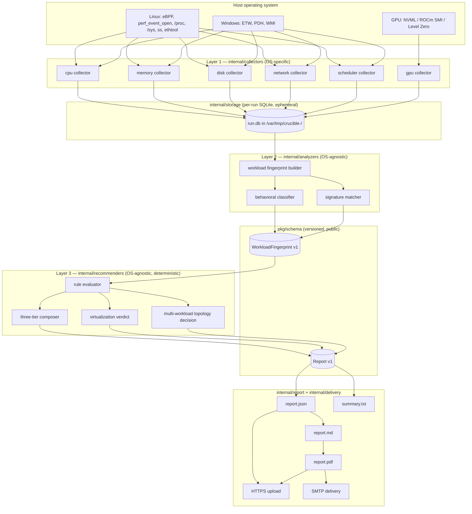

# Crucible Architecture

This document is the data-flow and layering contract referenced by
[`CLAUDE.md` §4](../CLAUDE.md). Read `CLAUDE.md` first for mission and
constraints; this file is the *how*, not the *why*.

---

## Guiding principle: three layers, one direction

Crucible is a one-way pipeline. Data flows strictly from raw OS-specific
counters at the bottom to a vendor-neutral hardware recommendation at the
top. No layer reaches back. Each layer has exactly one job and exposes one
stable contract.



---

## Layer 1 — `internal/collectors/`

**Responsibility:** turn live OS state into typed, timestamped, per-sample
metric records. Nothing else.

- One Go package per metric domain (`cpu`, `memory`, `disk`, `network`,
  `scheduler`, `gpu`, `power`).
- Each collector implements a common interface (sketch — locked in Phase 2):

  ```go
  type Collector interface {
      Name() string
      Capabilities(ctx context.Context) (CapabilityReport, error)
      Sample(ctx context.Context, t time.Time) ([]Metric, error)
      Close() error
  }
  ```

- **OS-specific.** Linux collectors live under `internal/collectors/linux/`,
  Windows under `internal/collectors/windows/`. Build tags (`//go:build
  linux` / `//go:build windows`) keep cross-compilation clean.
- **Capability degradation is local.** If a Linux CPU collector cannot open
  `perf_event_open`, *that collector* records the missing capability in its
  `CapabilityReport`. Higher layers must never re-detect.
- **No analysis.** Collectors do not compute IPC ratios, do not decide what
  "high" means. They emit numbers and timestamps.

Outputs go to `internal/storage/` (SQLite via `modernc.org/sqlite`, pure
Go). The DB lives in `/var/tmp/crucible-<runid>/` (Linux) or
`%TEMP%\crucible-<runid>\` (Windows) and is deleted at end of run unless
`--keep-raw`.

---

## Layer 2 — `internal/analyzers/`

**Responsibility:** turn the raw per-sample metric stream into a
**workload fingerprint** — a versioned, OS-agnostic struct that describes
*behavior*, not raw counters.

- Pure Go. No OS-specific imports. Unit-testable with fixture data.
- Three sub-concerns:
  1. **`signatures/`** — pattern-match known processes (Postgres, nginx,
     ffmpeg, …) by process-name + listen-port + cgroup + parent-PID rules
     loaded from `signatures/*.yaml`.
  2. **`classifier/`** — for unknown processes, cluster on
     resource-usage fingerprint and label heuristically ("CPU-bound batch
     worker, single-threaded, low I/O").
  3. **`fingerprint/`** — fold the per-sample stream into stable
     statistical summaries (percentiles, burstiness, NUMA locality, etc.)
     and emit a `pkg/schema.WorkloadFingerprint`.

The fingerprint struct is the **stable intermediate schema**. Future
LLM-assisted recommenders, web dashboards, and what-if simulators all
consume this same shape. Treat any change as a schema version bump.

---

## Layer 3 — `internal/recommenders/`

**Responsibility:** turn a workload fingerprint into a tiered hardware
recommendation. **Deterministic. No LLM calls at runtime in v1.**

- **Rule YAML** under `rules/v1/*.yaml`. Each rule has an ID, a predicate
  over fingerprint fields, an effect on the recommendation, and a
  rationale string. Rules are unit-tested independently of the evaluator
  (one fires-when-it-should test + one does-not-fire-when-it-shouldnt
  test per rule, minimum).
- **Three tiers per workload** — Budget / Balanced / Performance. Each
  tier carries rationale and a confidence score (0–100) with explicit
  drivers ("Window only 1 h; PMU counters unavailable").
- **Virtualization verdict** — bare-metal-required / safe-to-virtualize /
  safe-with-caveats, with expected percentage impact and the specific
  signals cited.
- **Multi-workload topology** — when more than one workload is detected
  on the host, the recommender emits both a consolidated spec and a
  split spec, with a recommendation between them.

The composed result is a `pkg/schema.Report` and is the final
consumer-facing artifact.

---

## `pkg/schema/` — the public API

Anything under `pkg/` is treated as a public API contract. From v1
onward:

- Field renames and removals require a schema version bump.
- Additive field changes ship under the existing major.
- `schema_version` is embedded in every emitted `report.json` and
  versioned independently of the Crucible binary version.

`pkg/schema/` has zero dependencies on `internal/*` packages. The reverse
is fine. This is enforced by import discipline; CI will block PRs that
violate it (lint rule landed in Phase 0).

---

## Cross-cutting concerns

### Context propagation

Every collector, analyzer, recommender, and renderer takes
`context.Context` as the first parameter of every long-running call.
Cancellation propagates from the top-level `crucible run` command
through every layer. No goroutine leaks; every goroutine spawned is
joined or has its lifetime tied to a parent context.

### Logging

`log/slog` everywhere. JSON sink → run-local file. Human-readable sink →
stderr. Log levels: `Debug`, `Info`, `Warn`, `Error`. No `fmt.Println`,
no `log.Printf` — CI enforces with a `golangci-lint` rule.

### Configuration precedence

Flags > config file > environment variables > built-in defaults. `viper`
handles the merge; the CLI layer is responsible for binding flags to
viper keys with consistent naming (`--steady-interval` ↔
`steady_interval` ↔ `CRUCIBLE_STEADY_INTERVAL`).

### Error handling

- Every syscall result checked.
- Errors wrap with `fmt.Errorf("…: %w", err)` so unwrapping works.
- **No `panic` in library code.** `panic` is reserved for "the binary
  itself is mis-built" (e.g., an init-time invariant violation in a
  generated file). User-input or environment-driven failures return
  errors.
- Top-level CLI commands convert errors into structured exit messages
  and non-zero exit codes; they never let raw stack traces escape to a
  user terminal except under `--debug`.

### Concurrency

- Sampler goroutines are CPU-cheap; one per collector domain. They write
  to a bounded, buffered channel consumed by a single writer goroutine
  per run, which batches into SQLite. This is the *only* fan-in point.
  No mutex-heavy shared state.
- Collectors that need privileged syscalls run on the main goroutine at
  startup to detect capability, then descend to non-privileged sampling
  loops where possible.

---

## What this architecture buys us in later phases

| Future capability | What lets it drop in |
| --- | --- |
| Web dashboard | `pkg/schema.Report` is already the JSON contract; the dashboard is a `report.json` consumer. |
| Fleet aggregation | Per-host `report.json` files aggregate by appending — the schema is stable and addressable. |
| Continuous monitoring | The collector layer already streams; we add a long-running mode and a different storage target. The recommenders are unchanged. |
| LLM-assisted recommender | The fingerprint schema is the prompt input. The deterministic rule recommender remains the source of truth; the LLM becomes an annotator. |
| What-if simulation | A second consumer of `WorkloadFingerprint` that produces a different `Report` (modeled, not measured). |

The pipeline is intentionally one-way and intentionally narrow at the
schema boundary. Everything ambitious we want to do later sits *above*
or *beside* the schema, not inside the collector or analyzer code.
